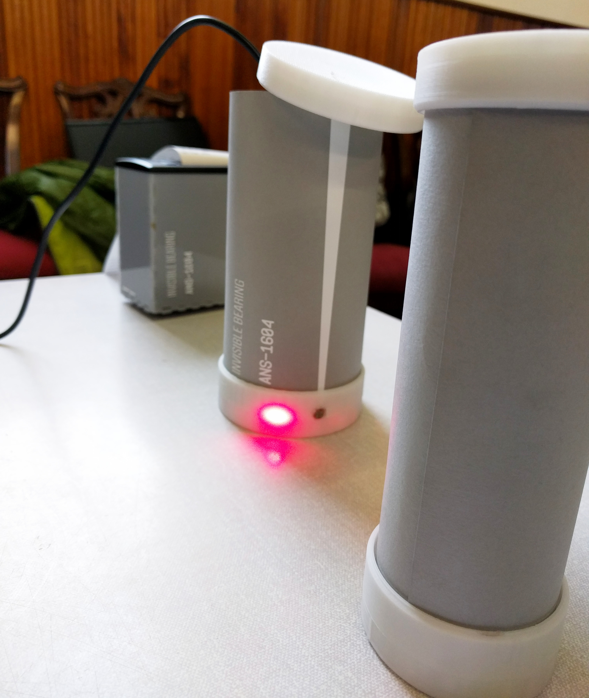
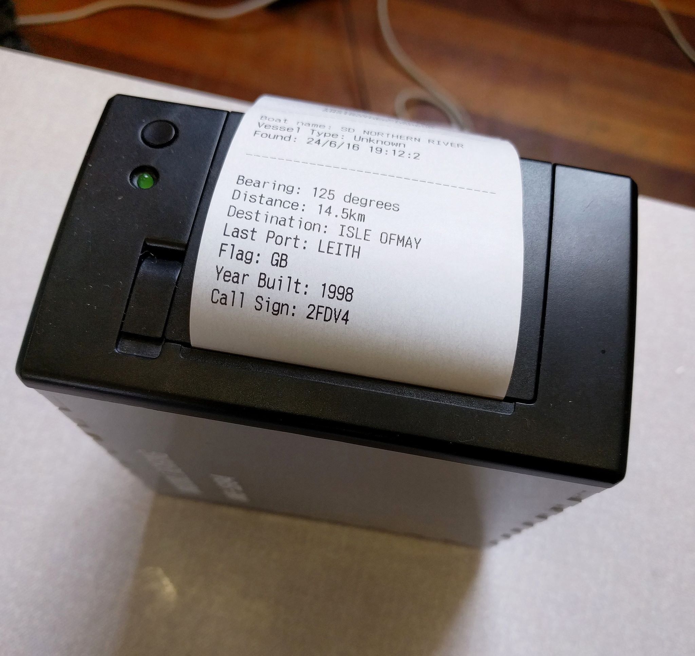

# Invisible Bearing

#### Plotting invisible data with a centuries-old navigational technique

*Project by Martin Skelly, Zandr Milewski, Tommaso Laterza, Stefano Paradiso, Dean Taylor, and Ali Napier at the Mozilla Open IoT Design Sprint in Anstruther, June 2016*

